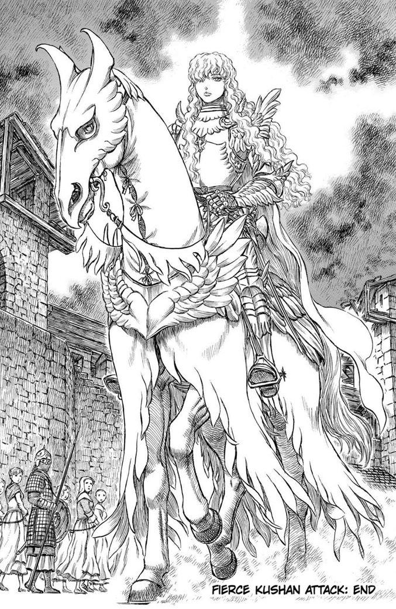

 
 
 
 

- Nombre: **Victoria Peralta**.

- De: **Argentina**.

- Actualmente: **Desarrolladora Full Stack** — TypeScript, React, Next.js, Node.js, C# y .NET.

- También: construyendo cosas copadas y aprendiendo algo nuevo todos los días.

 

 

### Tech Stack

  
  
  
  
  
  
  
  
  
  
  
  
  
  
  
  

 
 
 

  

"Me gusta mejorar constantemente en mis habilidades💕💻"

contacto: <a href="https://github.com/peraltavictoria">@peraltavictoria</a>

  

